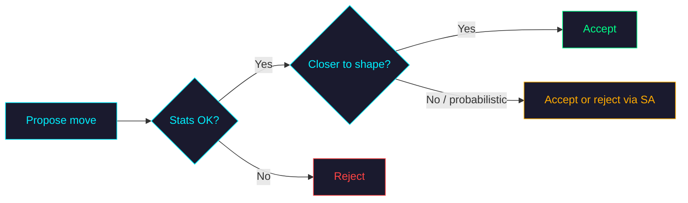

# Datasaurus

  

Nine different shapes. Same mean, same standard deviation, same correlation.

---

## Why this exists

King Charles III and Ozzy Osbourne share an oddly long list of attributes — born in 1948, raised in the UK, married twice, wealthy, famous, both living on grand estates. Describe either using just those descriptors and they're the same person.

That's the nature of any summary. You keep five numbers and lose the thousand things that made the data what it was. Most of the time it doesn't matter. Sometimes it does, and you don't notice until something breaks.

In 2017, Matejka & Fitzmaurice published twelve scatter plots that all share the same mean, standard deviation, and correlation — to two decimal places. One looks like a dinosaur. One a star. One a perfect circle. Identical numbers, completely unrelated shapes. The [Datasaurus Dozen](https://www.autodesk.com/research/publications/same-stats-different-graphs).

Reading it, three questions came up:

1. **Will this work for any arbitrary shape?** Tried 50. Most converge. Pick any outline you can imagine — given enough iterations, it'll work.
2. **Do different optimisation algorithms morph the shapes differently?** Yes. Momentum-based optimisation morphs faster because points pick up speed as they go, like balls rolling downhill. The other two take fixed-size steps every iteration.
3. **Do the shapes morph better with more points?** Yes. All while never breaking the summary statistics.

So this is a playground to explore all of that. Watch point clouds morph into shapes while the summary statistics refuse to move. Switch algorithms. Crank up the points. Or just sit back and watch Morph mode flow through 20 shapes automatically.

**If you don't plot your data, you don't understand your data.**

---

## What this tool does

| | Playground | Morph |
|---|---|---|
| **Experience** | Interactive — you pick shapes, tweak settings, run the simulation | Lean-back — press Simulate and watch |
| **Points** | 50–500 (default 142) | 10,000 (fixed) |
| **Shapes** | Any of 50, up to 16 at once in a grid | 20 curated shapes, one after another |
| **Algorithm** | Annealing, Langevin, or Momentum (your choice) | Projected gradient descent |
| **Constraint** | Rejection — moves that break stats are discarded | Projection — stats are restored exactly after each step |

Both modes enforce the same invariant at every frame:

| Statistic | Symbol | Target |
|---|:---:|:---:|
| Mean of x | $\bar{x}$ | 54.26 |
| Mean of y | $\bar{y}$ | 47.83 |
| Std dev of x | $s_x$ | 16.76 |
| Std dev of y | $s_y$ | 26.93 |
| Correlation | $r_{xy}$ | −0.06 |

> Tolerance: ±0.01 on every statistic, every frame, no exceptions.

---

## The problem

Given a target shape $S$ defined as a set of line segments, find a dataset $\{(x_i, y_i)\}_{i=1}^{n}$ that:

1. **Looks like $S$** — points lie close to the shape boundary
2. **Preserves five statistics** — mean, standard deviation, and correlation match fixed targets

Formally:

$$\min_{\{(x_i, y_i)\}} \sum_{i=1}^{n} d(p_i, S) \quad \text{subject to} \quad |\text{stat}_k - \text{target}_k| \leq 0.01 \;\; \forall k \in \{1..5\}$$

where $d(p_i, S) = \min_{q \in S} \|p_i - q\|_2$ is the distance from point $p_i$ to the nearest point on the shape boundary, computed via a KDTree built from the rasterised segments.

The two modes solve this with different strategies:

Playground: reject moves that break stats (one point at a time)

Morph: project back onto the constraint (all points at once)

---

## Playground algorithms

Playground mode moves **one point per step**. Each step picks a random point, proposes a move, and checks two gates:

1. **Stats gate.** Update five running sums ($\Sigma x, \Sigma y, \Sigma x^2, \Sigma y^2, \Sigma xy$) in $O(1)$. If any statistic leaves the tolerance band, revert immediately.
2. **Shape gate.** Accept if distance decreased, or if already within 2.0 units, or with probability $e^{-\Delta E / T}$.

Temperature follows an easeInOutQuad S-curve from 0.4 → 0.0, controlling exploration vs exploitation. The three algorithms differ only in how they propose the move.

### Annealing

*The original. From the paper.*

$$\mathbf{x}' = \mathbf{x} + \boldsymbol{\eta}, \quad \boldsymbol{\eta} \sim \mathcal{N}(0, 0.25 I)$$

Isotropic noise. No preferred direction. The point doesn't know where the shape is — it proposes a random move and the gates decide. Over hundreds of thousands of steps, the temperature schedule turns this random walk into a directed search. Correct but slow.

### Langevin

*Knows which way to go.*

$$\mathbf{x}' = \mathbf{x} + \alpha(1 - T)\hat{\mathbf{u}} + \alpha T \boldsymbol{\eta}$$

Drift toward the nearest boundary point ($\hat{\mathbf{u}}$), plus thermal noise. Early: noise dominates (exploration). Late: drift dominates (convergence). Points flow toward the boundary instead of stumbling into it.

### Momentum

*Carries speed. Overshoots. Settles.*

$$\mathbf{v} \leftarrow \text{clamp}\Big(0.85\,\mathbf{v} + 0.5\,\hat{\mathbf{u}} + \sigma \boldsymbol{\eta},\; \pm 1.5\Big), \quad \mathbf{x}' = \mathbf{x} + \mathbf{v}$$

Persistent velocity accumulates between steps. Points overshoot the boundary, swing back, and settle — visible as a bouncing motion. Covers more ground per step than the other two. Stats rejection zeros velocity; shape rejection reverses it ($\mathbf{v} \leftarrow -0.3\mathbf{v}$).

### At a glance

| | Annealing | Langevin | Momentum |
|---|---|---|---|
| **Proposal** | Random noise | Directed drift + noise | Accumulated velocity |
| **Knows shape direction?** | No | Yes | Yes |
| **Visual character** | Diffusion | Flow | Bounce and settle |
| **Convergence** | Slow | Fast | Fastest |
| **Best for** | Simplicity, faithfulness to the paper | Smooth convergence | Speed, long edges |

---

## Morph algorithm

*Moves all points at once. Projects back onto the constraint.*

Morph mode uses **projected gradient descent**. All 10,000 points move simultaneously toward the target shape, then a closed-form affine correction restores the statistics exactly. Every step makes progress.

**Each step:**

1. **Gradient step.** Query the KDTree for every point's nearest boundary point. Move each point toward it with a decaying learning rate, plus temperature-scaled noise.

2. **Project onto the constraint.** Three affine corrections, each $O(n)$:

   | Correction | Restores | Operation |
   |---|---|---|
   | Shift | $\bar{x}, \bar{y}$ | $x \leftarrow x + (\bar{x}_{\text{target}} - \bar{x})$ |
   | Scale | $s_x, s_y$ | $x \leftarrow \bar{x} + (x - \bar{x}) \cdot s_{\text{target}} / s$ |
   | Shear | $r_{xy}$ | $y \leftarrow y + \alpha \cdot (x - \bar{x})$, then re-scale $y$ |

After projection, all five statistics match the target to ~$10^{-6}$.

**Shape-to-shape transitions:** the point cloud carries forward — final positions from one shape become starting positions for the next. With 2,000 steps per shape, convergence reaches 99–100% of points within 2.0 units of the boundary.

---

## 50 shapes

Full list

`arch` · `arrow` · `away` · `bar_chart` · `bowtie` · `bullseye` · `circle` · `clover` · `cross` · `crown` · `diamond` · `dino` · `dots` · `double_sine` · `ellipse` · `eye` · `figure_eight` · `fish` · `grid` · `h_lines` · `heart` · `hexagon` · `high_lines` · `hourglass` · `house` · `infinity` · `lightning` · `mountain` · `octagon` · `pac_man` · `parabola` · `pentagon` · `rings` · `s_curve` · `scatter_4` · `sine` · `slant_down` · `slant_up` · `smiley` · `spiral` · `staircase` · `star` · `sun` · `tornado` · `triangle` · `v_lines` · `wave` · `wide_lines` · `x_shape` · `zigzag`

---

## Built with

Python · FastAPI · SSE · NumPy · SciPy · Next.js · Zustand · framer-motion · Canvas

See [CONTRIBUTING.md](CONTRIBUTING.md) to run it locally.

---

## Credits

[Same Stats, Different Graphs](https://www.autodesk.com/research/publications/same-stats-different-graphs) — Justin Matejka & George Fitzmaurice, ACM CHI 2017. The original Datasaurus was created by [Alberto Cairo](http://www.thefunctionalart.com/2016/08/download-datasaurus-never-trust-summary.html).
