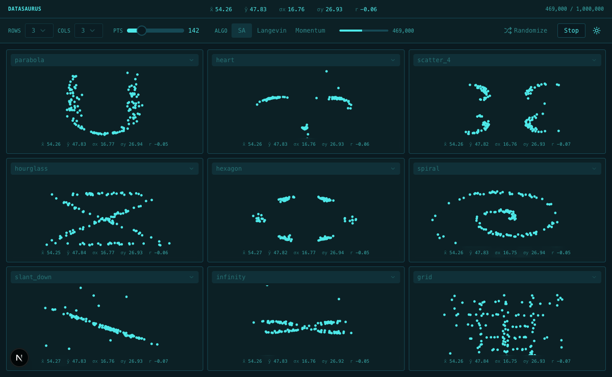

# Datasaurus

  

Nine different shapes. Same mean, same standard deviation, same correlation. Every cell reads x̄ ≈ 54.26, ȳ ≈ 47.83, σx ≈ 16.76, σy ≈ 26.93, r ≈ −0.06.

---

## Why this exists

When you summarize a dataset, you typically report a handful of numbers: the mean, the standard deviation, maybe the correlation between variables. These are the first things you compute, the first things you put in a table, and often the last things anyone looks at before drawing conclusions.

The problem is that these numbers throw away almost everything about the data. The mean tells you the center. The standard deviation tells you the spread. The correlation tells you the linear trend. But none of them tell you the *shape* — where the points actually are, how they cluster, what structure they form.

In 2017, Justin Matejka and George Fitzmaurice demonstrated this by constructing thirteen datasets that all share the same summary statistics to two decimal places but look completely different when plotted. One is a dinosaur. One is a star. One is a set of parallel lines. The five numbers are identical. The scatterplots have nothing in common.

The original Datasaurus — a T. rex hiding in a summary table — was created by Alberto Cairo to make this point. Matejka and Fitzmaurice turned it into a method: given any target shape, they could produce a dataset that matches any set of summary statistics while visually resembling that shape.

The lesson is simple and worth repeating: **if you don't plot your data, you don't understand your data.** Summary statistics are a lossy compression. They can hide structure, outliers, clusters, gaps, and patterns that would be obvious in a scatterplot. This tool lets you see that happen in real time.

---

## What this tool does

Datasaurus takes a target shape — a heart, a spiral, a hexagon, any of 50 built-in outlines — and rearranges a cloud of points until the cloud looks like that shape. By default there are 142 points (matching the original paper's dataset), but you can adjust this. The constraint: five summary statistics (mean x, mean y, standard deviation x, standard deviation y, and Pearson correlation) must stay within ±0.01 of their target values at every single step. Not just at the end. At every step.

The shapes are just geometry — line segments that form an outline. They don't have statistics. The point cloud has the statistics. The algorithm's job is to move points toward the shape boundary without ever letting the statistics slip. The result is a dataset that looks like a dinosaur but is statistically indistinguishable from a dataset that looks like a circle.

You can run nine shapes simultaneously in a grid. Each cell morphs independently, and each cell's stats overlay shows the same five numbers throughout. That's the whole point: the numbers are useless for telling the shapes apart.

---

## How it works

The algorithm starts with a cloud of random points (142 by default, configurable from 50 to 500) that already satisfy the target statistics. No structure yet — just noise with the right mean, spread, and correlation. Then, a million times:

1. Pick a random point. Nudge it with a small random perturbation.
2. Check all five statistics. If any one of them drifted outside ±0.01 of the target, reject the move immediately. This is the hard constraint — it is never relaxed.
3. Measure how far the point is from the nearest part of the target shape. If it got closer, accept. If it got further away, accept with a probability that depends on the current temperature.

The temperature starts high and falls along an S-curve over the course of the run. When the temperature is high, the system accepts bad moves freely — this lets points explore and avoid getting stuck. As the temperature drops, the system becomes selective, only accepting moves that bring points closer to the shape. By the end, the cloud has organized itself along the shape boundary and the statistics haven't moved.

## Three algorithms

All three enforce the same stat constraint on every step. They differ in how they propose moves in step 1.

**Simulated annealing** adds pure random noise to a randomly chosen point. The point has no idea where the shape is. It wanders, and the acceptance rule in step 3 gradually filters out moves that go the wrong way. Most proposals get rejected late in the run because random noise rarely moves a point closer to a specific boundary. This is the method from the original paper. It works, but it's slow.

**Langevin dynamics** gives each point a sense of direction. Before adding noise, it looks up the nearest point on the target shape boundary and biases the nudge toward it. The noise is still there — scaled to the current temperature — so it explores early and converges late. Fewer proposals get rejected because the proposals are better. Points flow toward the boundary instead of stumbling into it.

**Momentum** gives each point a velocity that persists between steps. The velocity accumulates in the direction of the shape boundary and decays by friction each step. Points overshoot the boundary, swing back, and settle. This produces a visible oscillation during the run that the other two don't have. It converges faster than Langevin on shapes with long straight edges, and slower on tight curves.

---

## The invariant

Every dataset this tool produces shares the same five numbers:

| | Mean | Std Dev |
|:--|--:|--:|
| **x** | 54.26 | 16.76 |
| **y** | 47.83 | 26.93 |
| **r** | −0.06 | |

These come from the original Datasaurus dataset. The tolerance is ±0.01, enforced on every step of every run.

---

## 50 shapes

`arch` · `arrow` · `away` · `bar_chart` · `bowtie` · `bullseye` · `circle` · `clover` · `cross` · `crown` · `diamond` · `dino` · `dots` · `double_sine` · `ellipse` · `eye` · `figure_eight` · `fish` · `grid` · `h_lines` · `heart` · `hexagon` · `high_lines` · `hourglass` · `house` · `infinity` · `lightning` · `mountain` · `octagon` · `pac_man` · `parabola` · `pentagon` · `rings` · `s_curve` · `scatter_4` · `sine` · `slant_down` · `slant_up` · `smiley` · `spiral` · `staircase` · `star` · `sun` · `tornado` · `triangle` · `v_lines` · `wave` · `wide_lines` · `x_shape` · `zigzag`

---

## Built with

Python · FastAPI · SSE · NumPy · SciPy · Next.js · Zustand · framer-motion · Canvas

See [CONTRIBUTING.md](CONTRIBUTING.md) to run it locally.

---

## Credits

[Same Stats, Different Graphs](https://www.autodesk.com/research/publications/same-stats-different-graphs) — Justin Matejka & George Fitzmaurice, ACM CHI 2017. The original Datasaurus was created by [Alberto Cairo](http://www.thefunctionalart.com/2016/08/download-datasaurus-never-trust-summary.html).
