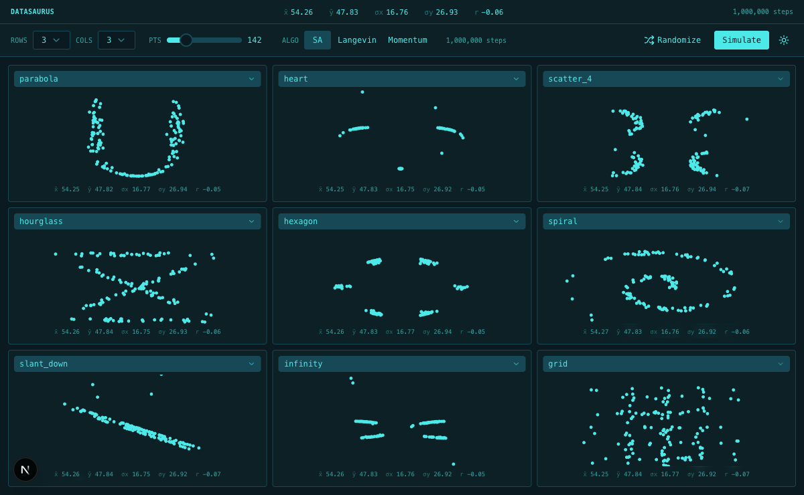

# Datasaurus

A dinosaur, a star, and a circle walk into a dataset. They have the same mean, the same standard deviation, and the same correlation. You cannot tell them apart by their statistics. You can only tell them apart by *looking*.

This is the core insight behind [Matejka & Fitzmaurice's 2017 CHI paper](https://www.autodesk.com/research/publications/same-stats-different-graphs): summary statistics can be identical across wildly different distributions. The only defense is to **plot your data**.

Datasaurus makes this visceral. Pick a grid of target shapes, hit Simulate, and watch 142 points rearrange themselves from random noise into recognizable figures — all while five statistics hold steady to two decimal places.

  

<em>Nine shapes, one million steps, identical statistics. Mid-simulation at step 469,000.</em>

---

## The numbers that never move

Every dataset produced by Datasaurus shares these five statistics, within ±0.01:

| | Mean | Std Dev |
|---|---|---|
| **x** | 54.26 | 16.76 |
| **y** | 47.83 | 26.93 |
| **Correlation** | −0.06 | |

A parabola and a heart. A spiral and a grid. An hourglass and an infinity sign. Same five numbers. Wildly different stories. The statistics never betray which shape you're looking at.

  

<em>Simulation complete. Every cell shows the same x̄, ȳ, σx, σy, and r — to two decimal places.</em>

---

## How it works

The algorithm starts with 142 random points that already satisfy the target statistics. Then, one million times:

1. **Pick a point. Nudge it.** A small Gaussian perturbation — just enough to explore.
2. **Check the stats.** If any of the five statistics drifts outside ±0.01 tolerance, the move is rejected. Non-negotiable.
3. **Check the shape.** If the point moved closer to the target, accept. If not, maybe accept anyway — with a probability that shrinks as the system cools.

The temperature follows an easeInOutQuad curve: exploratory early, precise late. By the end, the point cloud has reorganized into a recognizable shape. The five numbers have not changed.

Three algorithms are available, each with a distinct visual character:

- **Simulated Annealing** — the classic blind random walk with Metropolis acceptance
- **Langevin Dynamics** — gradient-guided drift toward the shape boundary, plus temperature-scaled noise
- **Momentum** — heavy-ball descent where velocity accumulates, creating a sweep-and-oscillate motion

---

## 50 shapes

Every shape is defined as line segments in code. The simulated annealing process can morph a point cloud into any of them.

| | | | | |
|---|---|---|---|---|
| arch | arrow | away | bar_chart | bowtie |
| bullseye | circle | clover | cross | crown |
| diamond | dino | dots | double_sine | ellipse |
| eye | figure_eight | fish | grid | h_lines |
| heart | hexagon | high_lines | hourglass | house |
| infinity | lightning | mountain | octagon | pac_man |
| parabola | pentagon | rings | s_curve | scatter_4 |
| sine | slant_down | slant_up | smiley | spiral |
| staircase | star | sun | tornado | triangle |
| v_lines | wave | wide_lines | x_shape | zigzag |

---

## The stack

**Backend** — Python, FastAPI, Server-Sent Events. The annealing runs in thread pool executors with cancellation support. Each SSE frame carries the full point cloud for every shape in lockstep.

**Frontend** — Next.js, Zustand, framer-motion. Scatter plots render on canvas with spring-animated transitions between frames. The grid is configurable up to 5×5 with per-cell shape selection.

**223 tests** covering stats validation, geometry for every shape, SA invariants, and all API endpoints.

---

## Contributing

See [CONTRIBUTING.md](CONTRIBUTING.md) for setup instructions and development workflow.

---

## Credits

Based on [Same Stats, Different Graphs](https://www.autodesk.com/research/publications/same-stats-different-graphs) by Justin Matejka and George Fitzmaurice (ACM CHI 2017). The original Datasaurus was created by Alberto Cairo.
